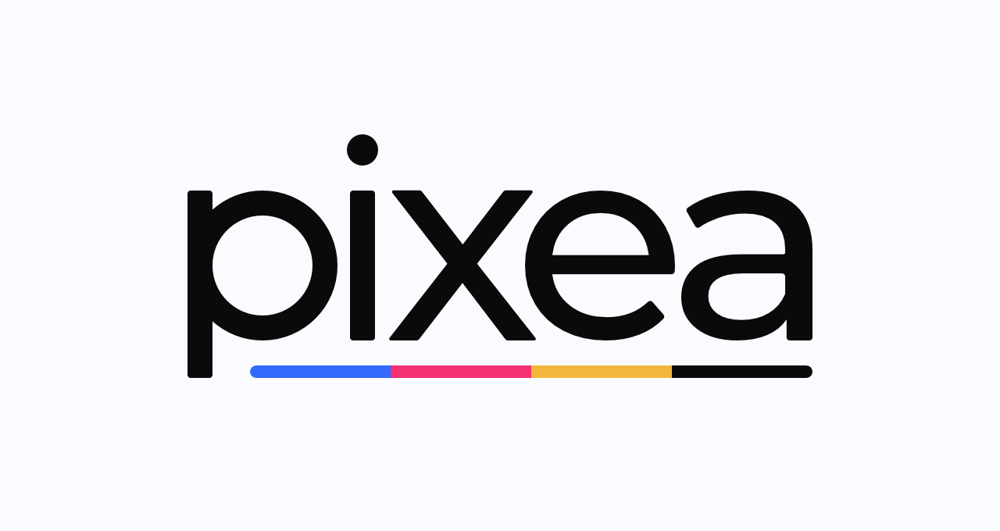
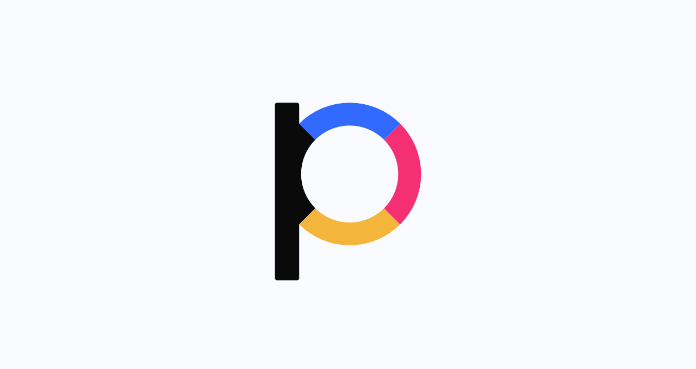

# Brand Guide

## Logo
### Logos for download
| Logotype                | Logotype BW                | Icon                | Icon BW                |
|-------------------------|----------------------------|---------------------|------------------------|
|[.svg](logo/Logotype.svg)|[.svg](logo/Logotype_BW.svg)|[.svg](logo/Icon.svg)|[.svg](logo/Icon_BW.svg)|
|[.png](logo/Logotype.png)|[.png](logo/Logotype_BW.png)|[.png](logo/Icon.png)|[.png](logo/Icon_BW.png)|
|[.eps](logo/Logotype.eps)|[.eps](logo/Logotype_BW.eps)|[.eps](logo/Icon.eps)|[.eps](logo/Icon_BW.eps)|

### The logo itself
The logo consists of the brand name "pixea" and four color stripes representing the CMYK color model. This color model shows that the brand is connected to print.

*This is the main logotype which should be displayed on every one of our products.*

*This is the main icon which serves as an avatar and is useful anywhere where's a lack of space.*

### The usage of the logo
The logotype and the icon must be always displayed separately, never together. The logotype and the icon should not be used differently than is displayed here - without any visual effects, in other colors, in different aspect ratios and so on.

Empty space around the logotype and the icon, called the safe area, must always be used.

When it comes to the logotype, it must be used as displayed here:
 

*Watchout for the dot on letter "i", it does not count.*

And when it comes to the icon:

When changing the size of the logotype or the icon, the aspect ratio should be always the original and the size of at least one side should be a multiple of the number 4, for example, **320** x **124**px, **320** x 125px or 321 x **124**px.

The main background for the logotype and the icon is a light defined color, for other let's say a darker background, the black and white version of the logotype or the icon must be used.

## Colors
The color palette will open after clicking on the image.

## Typography
### Roboto
This is the main font. It is used mainly for the body text etc.

### HK Grotesk
This font is used for headlines.

*The example of typography usage.*