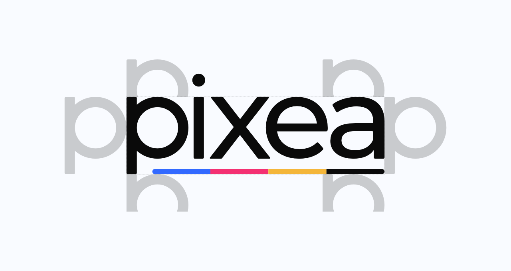
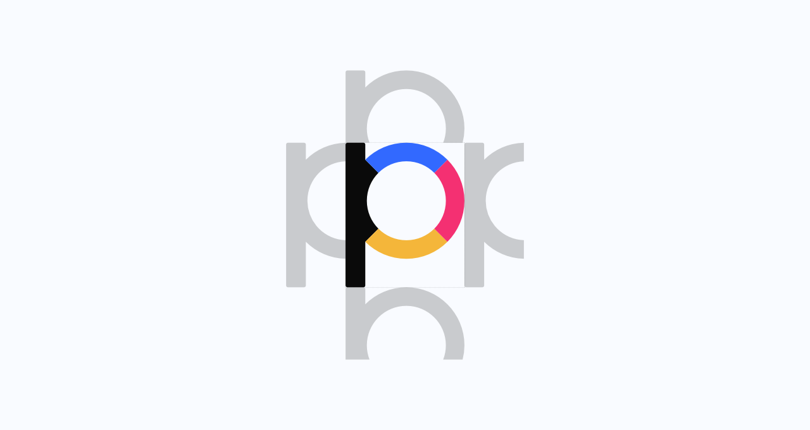
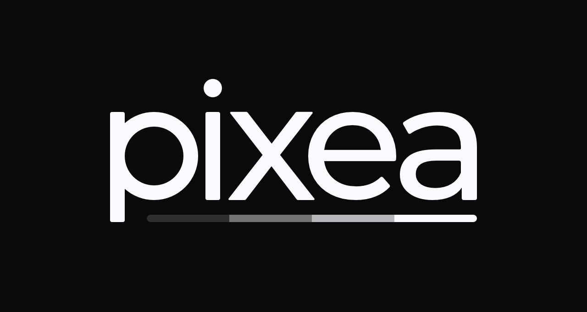

# Brand Guide

## Logo
### Logos for download
| Logotype                | Logotype BW                | Icon                | Icon BW                |
|-------------------------|----------------------------|---------------------|------------------------|
|[.svg](logo/Logotype.svg)|[.svg](logo/Logotype_BW.svg)|[.svg](logo/Icon.svg)|[.svg](logo/Icon_BW.svg)|
|[.png](logo/Logotype.png)|[.png](logo/Logotype_BW.png)|[.png](logo/Icon.png)|[.png](logo/Icon_BW.png)|

### The logo itself
The logo consists of the brand name "pixea" and four color stripes representing the CMYK color model. This color model shows that the brand is connected with print..

*This is the main logotype which should be displayed on each one of our products.*

*This is the main icon which serves as an avatar and is useful anywhere with a lack of space.*

### The usage of the logo
The logotype and the icon must always be displayed separately, not together. The logotype and the icon should not be used differently than how it's displayed here - without any visual effects, in other colors, in different aspect ratios and so on.

Empty space around the logotype and the icon, called the safe area, must always be used.

When it comes to the logotype, it must be used as displayed here:
 

*Watch out for the dot on the letter "i" as it does not count.*

And when it comes to the icon:

When changing the size of the logotype or the icon, the aspect ratio should always stay original and the size of at least one side should be a multiple of the number 4, for example, **320** x **124**px, **320** x 125px or 321 x **124**px.

The main background for the logotype and the icon is in a light pre-defined color, for other, let's say a darker background, the black and white version of the logotype or the icon must be used.

## Colors
The color palette will open once clicked on the image. 

## Typography
### Roboto
This is the main font. It is used mainly for body text and so on.

### HK Grotesk
This font is used for headlines.

*Example of typography usage.*