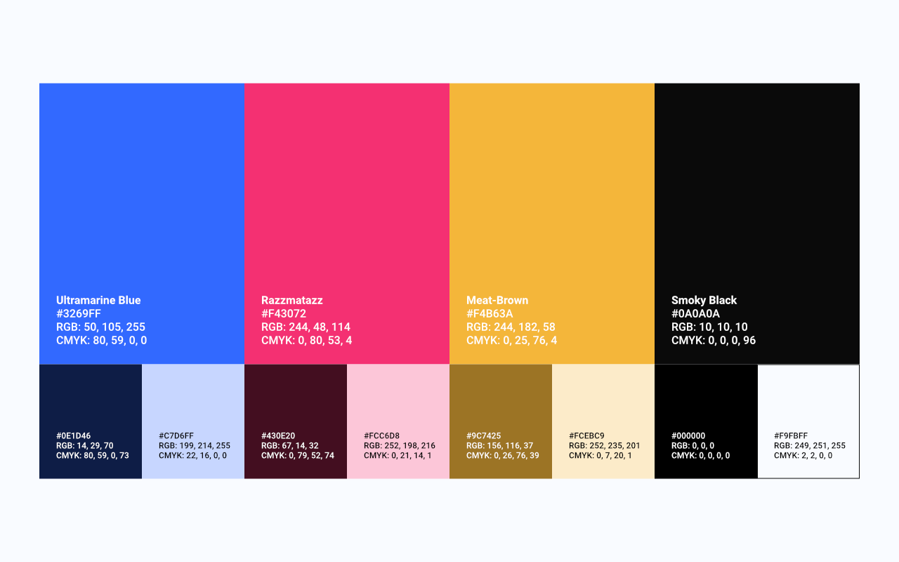

# Brand Guide
Príručka k značke a jej vizuálnému zobrazeniu.

## Príbeh
### Naša vízia
Byť špičkou vo svojej oblasti, neustále zlepšovať kvalitu produktov.

### Naša misia
Doručiť našim zákazníkom kvalitné produkty, ktoré spĺňajú ich očakávania.

## Logo
### Logo, ako také
Logo sa skladá z názvu "pixea" a štyroch farebných prúžkov, ktoré predstavujú farebný model CMYK. Tento farebný model vyzobrazuje, že značka je spojená s tlačou.

*Hlavný logotyp našej značky, mal by byť vyzobrazený na každom našom produkte.*

*Hlavná ikona našej značky. Slúži ako avatar a hodí sa všade kde je málo miesta.*

### Použitie loga
Logotyp a ikona musia byť vždy použité osobitne, nikdy spolu. Logotyp a ikona by nemali byť nikdy použité inak ako je tu vyzobrazené - bez rôznych efektov, v iných farbách, s nedodržaním pomeru strán a pod.

Voľné miesto okolo logotypu a ikony, takzvaná "safe area", musí byť vždy dodržaná.

Pre logotyp to je polovica písmena "p" z logotypu po stranách logotypu. 

*Pozor na to, že v logotype sa neberie do úvahy aj bodka na písmene "i".*

Pre ikonu to je horizontálna polovica ikony po vrchnej a spodnej strane ikony + vertikálna polovica po pravej a ľavej strane ikony.

Pri hýbaní s veľkosťou logotypu a ikony by mal byť vždy zachovaný pomer strán a veľkosť jednej strany by mal byť násobkom čísla 4, napr. 320 x 124 px.

Základným podkladom pre logotyp a ikonu je svetlá stanovená farba, na iný napr. tmavý podklad, musí byť použitá čiernobiela verzia logotypu a ikony.

## Farby

## Typografia
### Roboto
Tento font je hlavný, používa sa najmä na body text a pod.

### HK Grotesk
Tento font sa využíva na nadpisy.

*Príklad použitia typografie.*