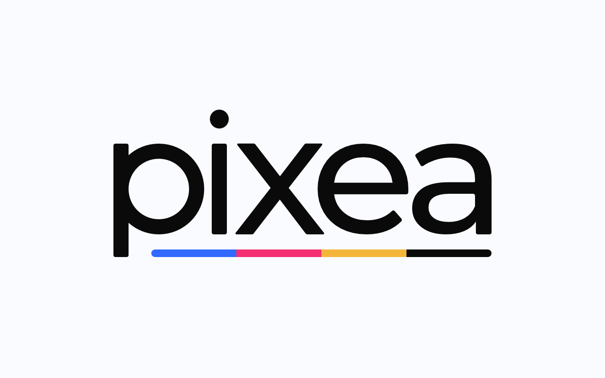
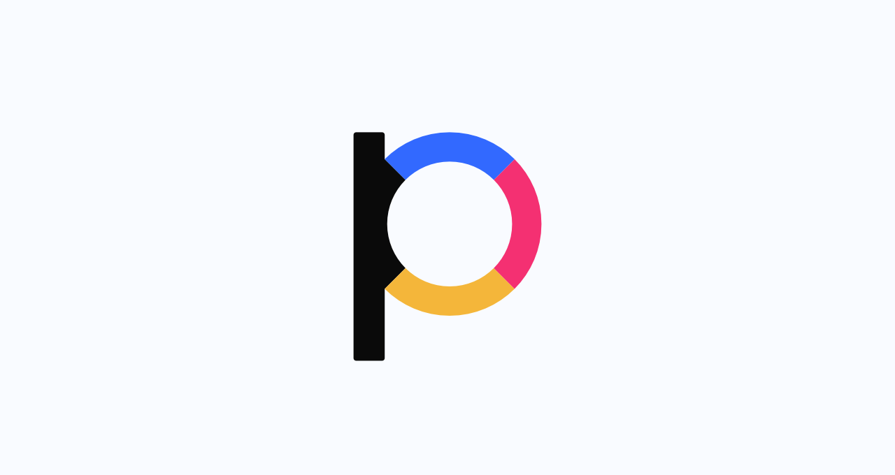
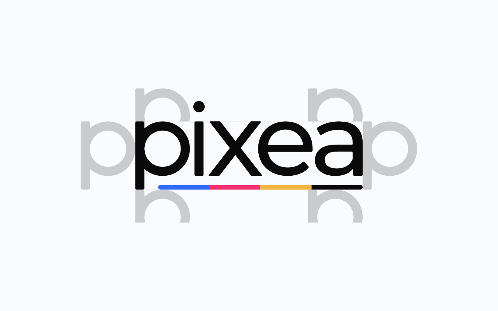
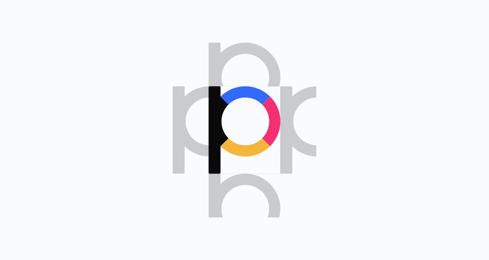
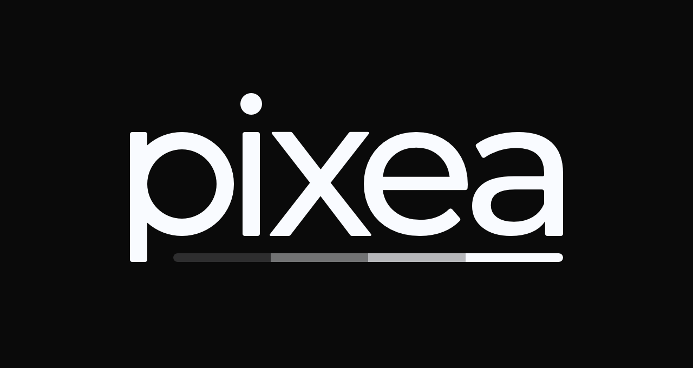
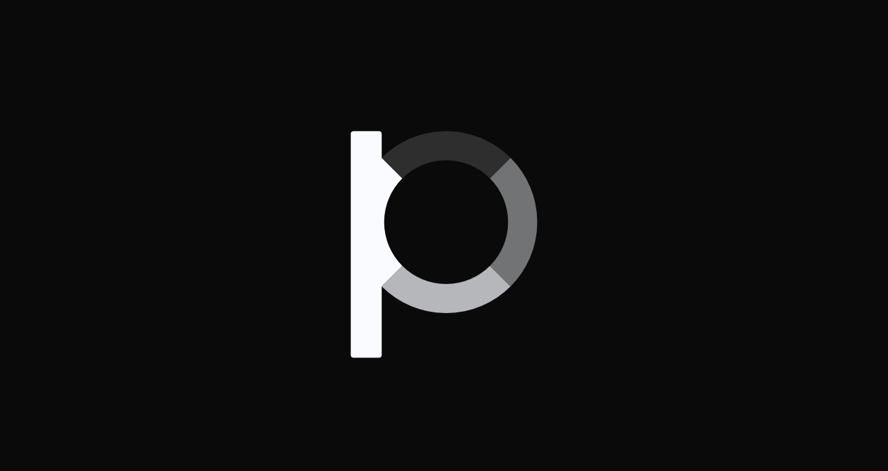
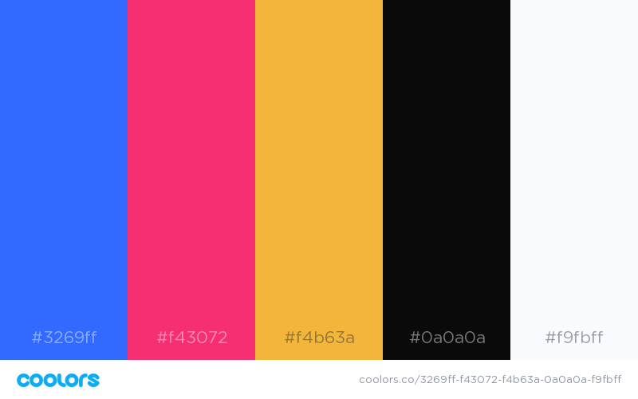
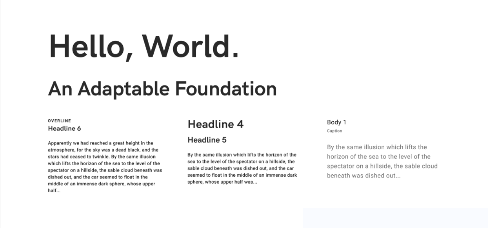

# Brand Guide
Príručka k značke a jej vizuálnému zobrazeniu.

## Logo
### Logá na stiahnutie
| Logotyp                 | Logotyp ČB                 | Ikona               | Ikona ČB               |
|-------------------------|----------------------------|---------------------|------------------------|
|[.svg](logo/Logotype.svg)|[.svg](logo/Logotype_BW.svg)|[.svg](logo/Icon.svg)|[.svg](logo/Icon_BW.svg)|
|[.png](logo/Logotype.png)|[.png](logo/Logotype_BW.png)|[.png](logo/Icon.png)|[.png](logo/Icon_BW.png)|

### Logo, ako také
Logo sa skladá z názvu "pixea" a štyroch farebných prúžkov, ktoré predstavujú farebný model CMYK. Tento farebný model vyzobrazuje, že značka je spojená s tlačou.

*Hlavný logotyp našej značky - mal by byť vyzobrazený na každom našom produkte.*

*Hlavná ikona našej značky - slúži ako avatar a hodí sa všade kde je málo miesta.*

### Použitie loga
Logotyp a ikona musia byť vždy použité osobitne, nikdy spolu. Logotyp a ikona by nemali byť nikdy použité inak ako je tu vyzobrazené - bez rôznych efektov, v iných farbách, s nedodržaným pomerom strán a pod.

Voľné miesto okolo logotypu a ikony, takzvaná "safe area", musí byť vždy dodržaná.

Pre logotyp to bude takto:
 

*Pozor na to, že v logotype sa neberie do úvahy aj bodka na písmene "i".*

A pre ikonu:

Pri hýbaní s veľkosťou logotypu a ikony by mal byť vždy zachovaný pomer strán a veľkosť jednej strany by mala byť násobkom čísla 4, napr. 320 x 124 px.

Základným podkladom pre logotyp a ikonu je svetlá stanovená farba, na iný napr. tmavý podklad, musí byť použitá čiernobiela verzia logotypu a ikony.

## Farby
Paleta farieb sa otvorí kliknutím na obrázok.

## Typografia
### Roboto
Tento font je hlavný, používa sa najmä na body text a pod.

### HK Grotesk
Tento font sa využíva na nadpisy.

*Príklad použitia typografie.*